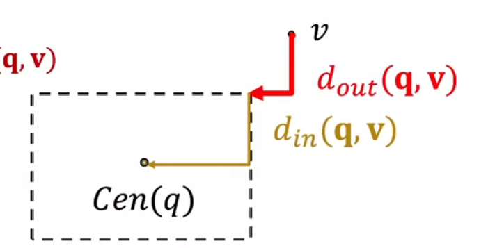
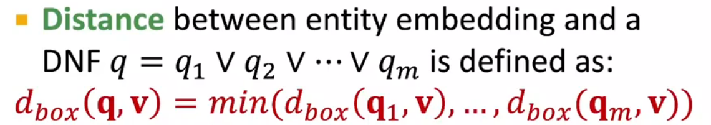
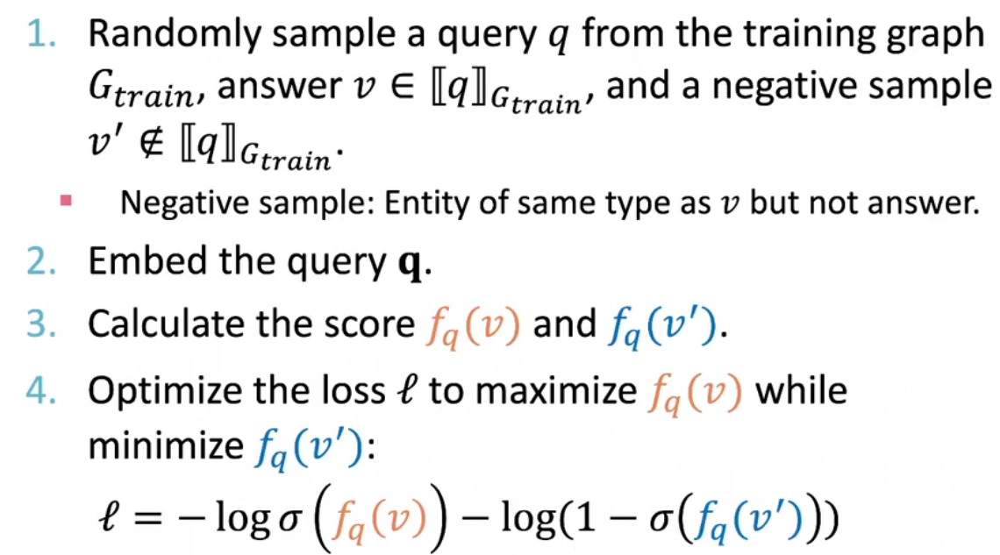

# Graph Machine Learning
## Knowledge Graph

### KG Representation

| KnowledgeGraph Represent | Define                                                    | scoring func              | symmetric relation | antisymmetric  | inverse               | composition | 1-to-N             |
| ------------------------- | --------------------------------------------------------- | ------------------------- | ------------------ | -------------- | --------------------- | ----------- | ------------------ |
| Translate Embeddings      | $entities,relations\in \mathbb{R}^d$                      | $-norm(h+r-t)$            | no                 | yes (r1=-r2)   | yes   (r3=r1+r2)      | yes         | no                 |
| TransR                    | $entities \in R^d; relation\in R^k, M_r\in R^{k\times d}$ | $-norm(M_rh+r-M_rh)$      | yes (r=0)          | yes($r\neq0$ ) | yes(r1=-r2,Mr1=Mr2)   | no          | yes (proper $M_r$) |
| Dismult                   | $entities,relations\in \mathbb{R}^k$                      | $<h,r,t>$(cosine similar) | yes(naturally)     | no             | no                    | no          | no                 |
| ComplEx                   | $entities,relations\in \mathbb{C}^k$                      | $Re<h,r,\bar{t}>$         | yes(naturally)     | yes            | yes ($r_1=\bar{r_2}$) | no          | yes                |

### KG Reasoning
path-based queries on incomplete KG
- use TransE: query embedding q=h+r, **goal=-||q-t||** 
- query2box: query：$\mathbf{q}=(Center(q),Offset(q))$ a hyper-rectangle that includes all the answers 
  - $Cen(q′)=Cen(q)+Cen(r)$
  - $Off(q′)=Off(q)+Off(r)$
  - score func $f_q(v)=-d_{box}(q,v)=-d_{out}(q,v)-\alpha d_{in}(q,v)$
  - 
  - how to answer AND-OR queries? rewrite the query in DNF (disjunctino of conjunctive queries) get every answer for the conjunctive and aggregate in the last step.
  - 
  - 
**training**
